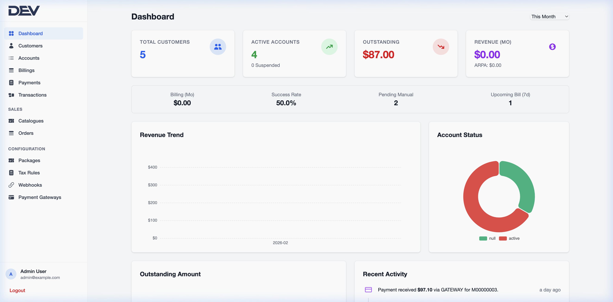
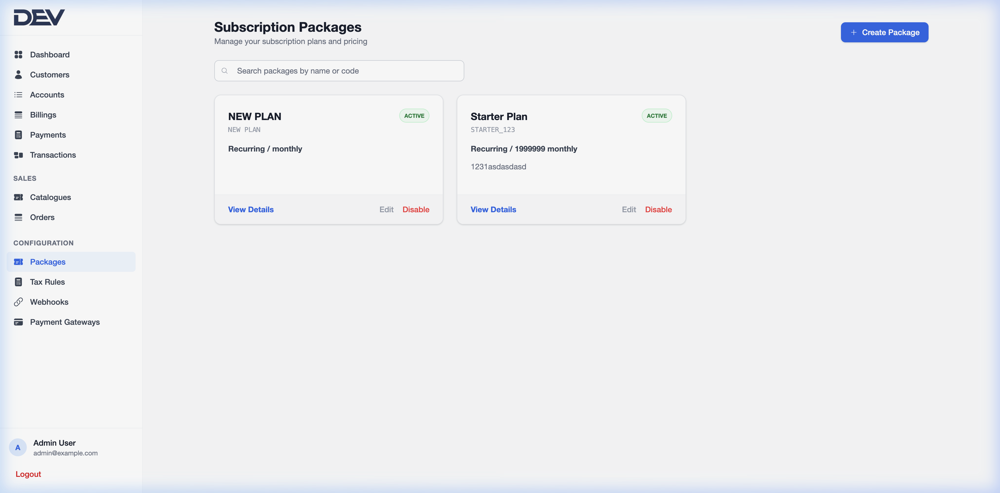
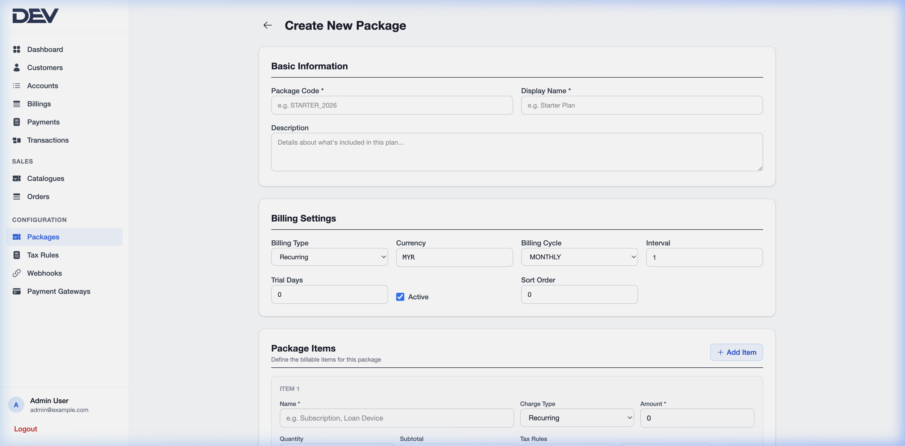
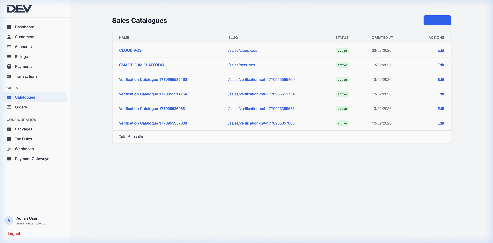
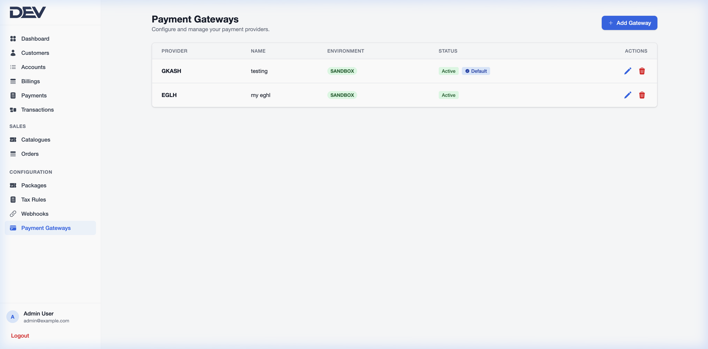
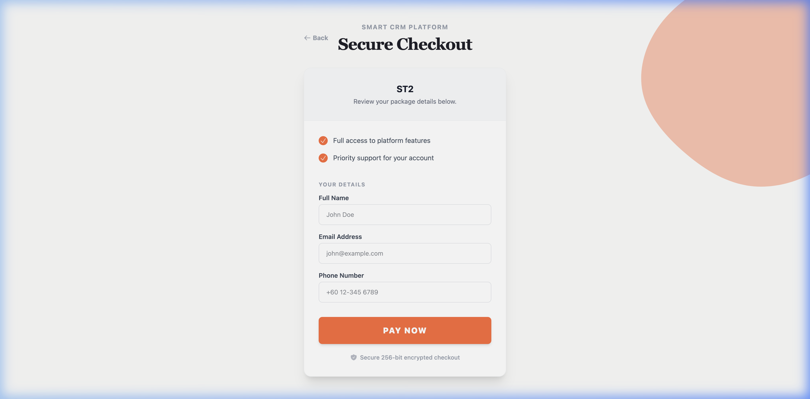
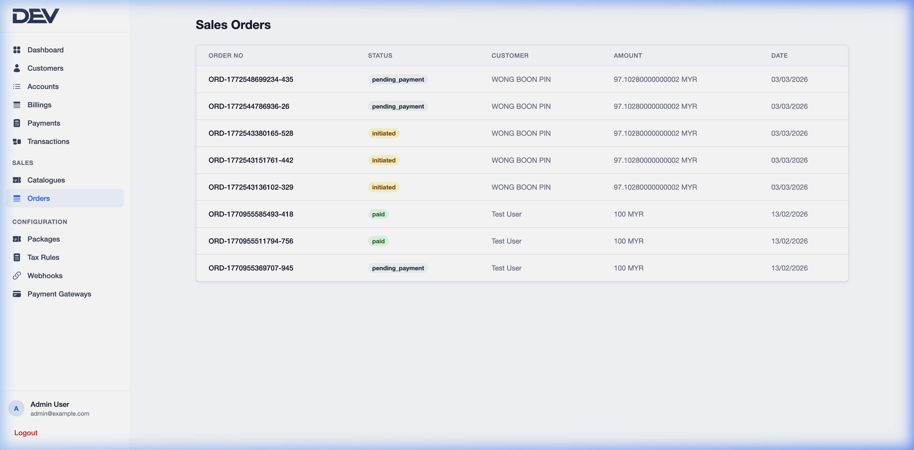

# Portfolio: Billing and Subscription System

This billing system allows administrators to manage subscription packages, sales catalogues, and track financial transactions. It provides a secure, white-labeled storefront for customers to browse and purchase services.

## High-Fidelity Screenshots

Here are captured screens representing the core workflows of the billing system:

### 1. Administrative Dashboard

### 2. Subscription Packages Configuration

### 3. Package Creation Form

### 4. Sales Catalogues Management

### 5. Configured Payment Gateways

### 6. Secure Checkout Iterface

### 7. Order Tracking & Transactions

## Key Features
- **Subscription Management**: Create and manage flexible billing plans (recurring or one-time).
- **Sales Catalogues**: Organize packages into custom catalogues for different sales channels.
- **Secure Checkout**: High-conversion, mobile-responsive payment interface with built-in payment gateway integrations (e.g., GKASH, EGLH).
- **Financial Dashboard**: Comprehensive tracking of orders, payments, and transaction history.

## System Workflow
1. **Define Packages**: Admin creates service tiers with specific pricing and billing cycles.
2. **Setup Catalogue**: Packages are grouped into catalogues with unique URLs for marketing.
3. **Capture Payment**: Customers select plans and complete secure payments via a streamlined UI.
