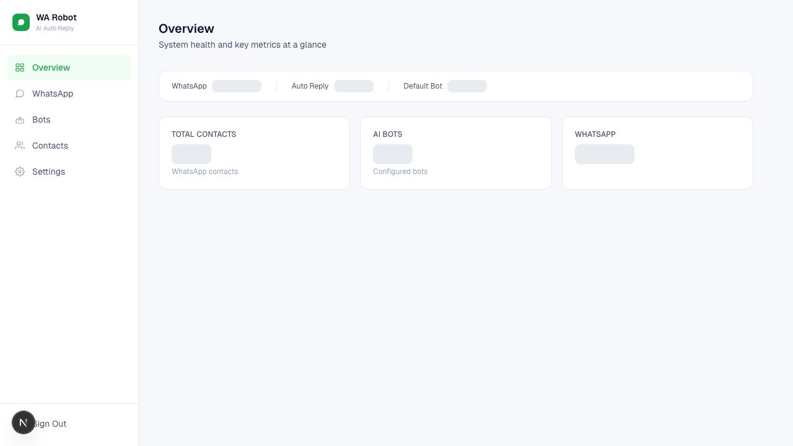
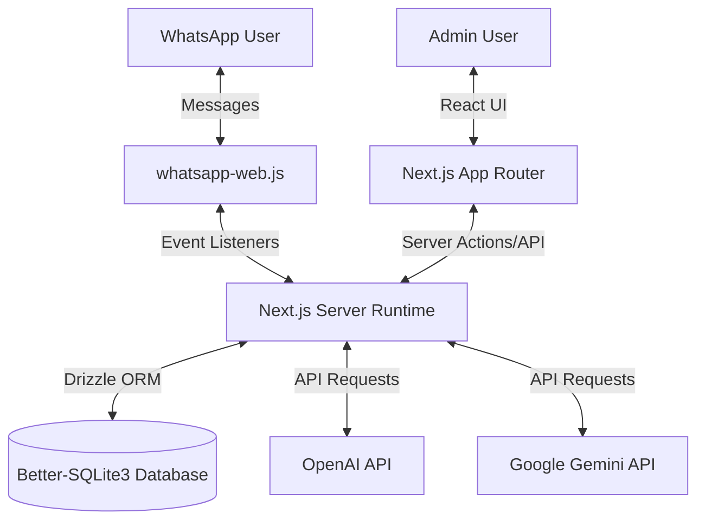
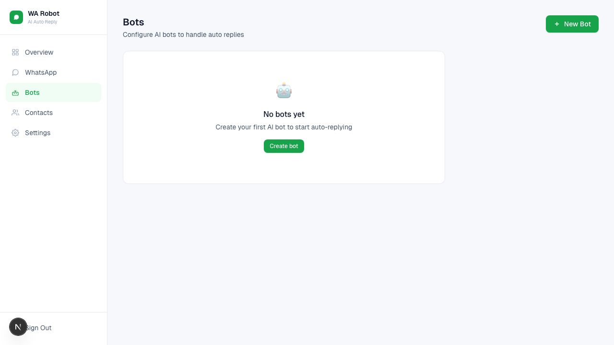
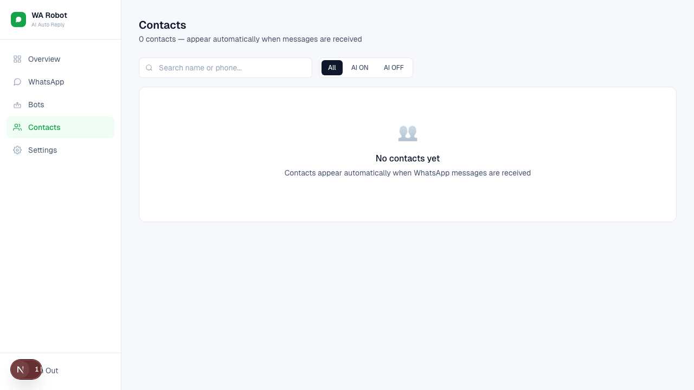
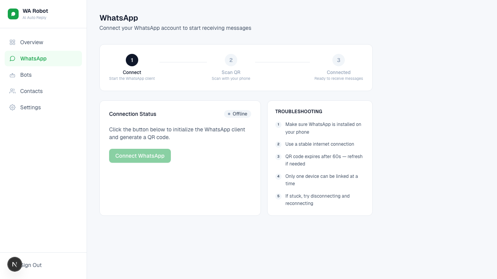
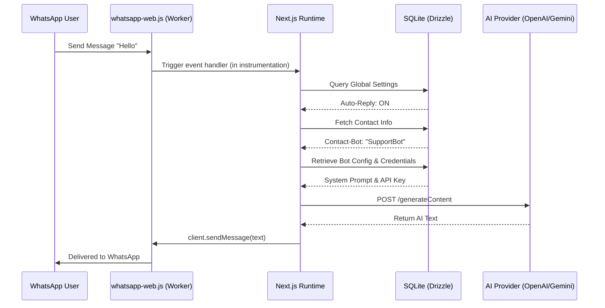

# System Design: WhatsApp AI Automation Handler

## 1. Executive Summary
The **WhatsApp AI Automation Handler** is a full-stack automation platform that integrates WhatsApp messaging with advanced LLM capabilities (OpenAI and Google Gemini). Built as a unified **Next.js** application, it provides businesses with a seamless dashboard to manage automated customer interactions, configure AI personalities, and monitor real-time message flows.

---

## 2. System Architecture
The system is built as a consolidated full-stack application leveraging Next.js, allowing for tight integration between the background messaging workers and the frontend management interface.

### 2.1 High-Level Overview

### 2.2 Component Breakdown
- **Full-Stack Core (Next.js 16):** A unified application handling both the React-based frontend (App Router) and the backend logic (Server Actions, API Routes, and Background Workers).
- **Messaging Background Worker (`instrumentation.ts`):** Utilizes the Next.js instrumentation hook to launch and maintain long-running WhatsApp instances via `whatsapp-web.js` within the Node.js runtime.
- **AI Orchestration Layer:** Handles complex prompt construction, provider-specific API calls, and response parsing for OpenAI and Google Gemini.
- **Persistent Data Layer:** Uses **Better-SQLite3** with **Drizzle ORM** for high-performance, local data storage of bot configurations and session metadata.
- **Middleware Security:** Implements custom session-based authentication for the dashboard and API protection.

---

## 3. Core Features & Functionality

### 3.1 AI Bot Orchestration
- **Dynamic Personalities:** Define multiple bots with unique system prompts, instructions, and target AI providers.
- **Unified Provider Interface:** Seamlessly switch between OpenAI and Gemini without changing business logic.
- **Parameter Control:** Customize AI behavior per bot (Enabled/Disabled status, specific API keys).

### 3.2 Intelligent Message Routing
A hierarchical logic engine processes each incoming message:
1. **System Filter:** Checks global auto-reply master switch.
2. **Contact Filter:** Identifies the sender and checks their specific AI-enabled preference.
3. **Bot Selection:** Dispatches to a contact-specific assigned bot or falls back to the system-level default bot.

### 3.3 WhatsApp Session Lifecycle
- **QR Code Authentication:** Generates and displays dynamic QR codes for secure multi-device linking.
- **State Persistence:** Automatically restores authenticated sessions upon application restart using stored local session data.
- **Live Monitoring:** Real-time feedback on connection status across the dashboard.

---

## 4. Technical Stack
| Category | Technology |
| :--- | :--- |
| **Framework** | Next.js 16 (App Router) |
| **Language** | TypeScript |
| **Styling** | TailwindCSS 4 |
| **Database** | Better-SQLite3 |
| **ORM** | Drizzle ORM |
| **WA Integration**| whatsapp-web.js |
| **AI Providers** | OpenAI API, Google Generative AI |

---

## 5. Sequence Diagram: Message Processing Flow
The following diagram illustrates how the system handles a "headless" message event within the Next.js runtime.

---

## 6. Key Implementation Highlights
- **Instrumentation Lifecycle:** Specifically using `instrumentation.ts` to ensure background WhatsApp clients start with the server, even in a serverless-focused framework like Next.js.
- **Type-Safe Database Access:** Using Drizzle ORM to ensure consistency between the relational schema and the application logic.
- **Client-Side Sockets/Polling:** Providing real-time updates for WhatsApp connection status on the dashboard.

---

## 7. Future Roadmap
- **RAG Capability:** Integrating vector databases for "chat-with-your-docs" functionality.
- **History Summarization:** Using LLMs to provide summaries of previous conversations to agents.
- **Multi-Tenant Dashboard:** Extending the UI to support multiple simultaneous WhatsApp sessions.
